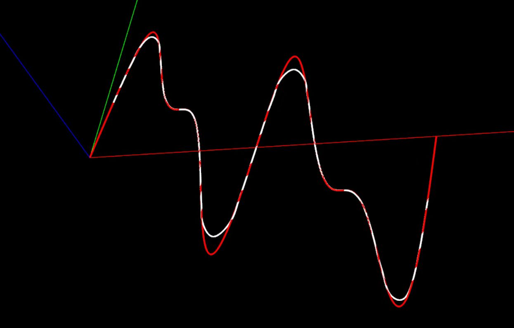
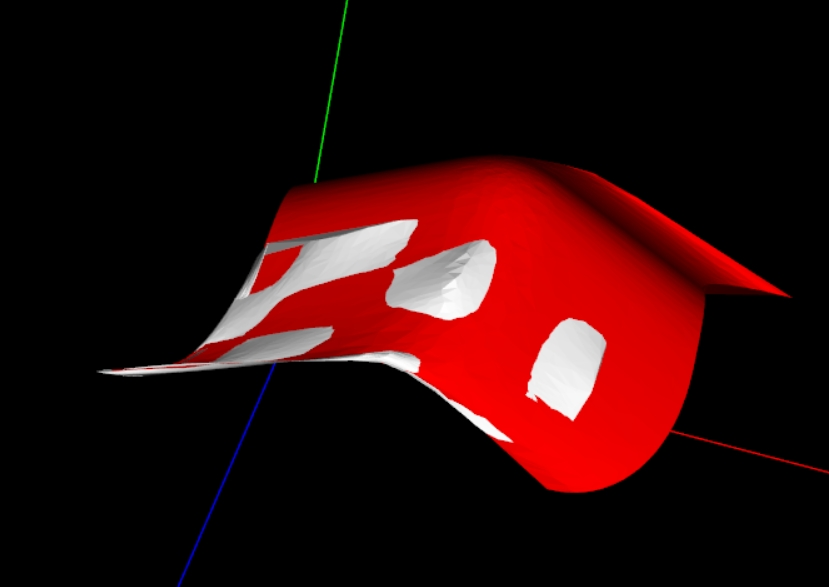

## Introduction
**LNLib is a C++ NURBS Algorithms Library.** <br/>These algorithms are primary referenced from [The NURBS Book 2nd Edition](https://link.springer.com/book/10.1007/978-3-642-97385-7). <br/>The APIs are re-designed to make it more friendly to users.

## API Languages:
- **C++** (Native)
- **Javascript**  (WebAssembly by Emscripten)
- **Python**  (pybind11)
- **.NET** (P/Invoke & .NET8.0)


## Build Project
- **LNLib**: Native C++ version. Run **build.bat** first to construct Native C++ solution by CMake.
- **LNLibjs**: WebAssembly version of LNLib, Run script in **emscripten** folder.
- **PyLNLib**: Python version of LNLib, switch `ENABLE_PYTHON_API` to `ON` in CMakeLists.txt and run **build.bat**.
- **LNLibSharp**: .NET version of LNLib, switch `ENABLE_DOTNET_API` to `ON` in CMakeLists.txt and run **build.bat**.

***notice***: Unit tests now only cover Native C++ API on Windows System.

## Features
Basic Elements:
- UV
- XYZ
- XYZW
- Matrix4d
- LNObject

Algorithms in ***The Nurbs Book***:
|Chapter|Content|
|--|--|
|***Chapter 1***  | Basis Function Computation |
|***Chapter 1 to 4***  | Bezier/B-Spline/NURBS Curve and Surface |
|***Chapter 5***  | Curve and Surface Decomposition</br>Knot Insertion/Refinement/Removal</br>Degree Elevation and Reduction |
|***Chapter 6***  | Curve/Surface Point Inversion</br>Surface Tangent Vector Inversion</br>Curve/Surface Reparameterization</br>Curve Transform and Reverse</br> Surface Swap and Reverse|
|***Chapter 7***  | Create Arc/Conic Curve |
|***Chapter 8***  | Create Bilinear/Cylindrical/Ruled/Revolved/CornerFillet Surface |
|***Chapter 9***  | Global/Local Curve/Surface Interpolation and Approximation |
|***Chapter 10***  | Create Swung/Loft/Sweep/Gordon/Coons Surface |
|***Chapter 11***  | Curve Modification in Control Point Locations or Weight Values |
|***Chapter 12***  | Curve Clamp/UnClamp/IsClamp </br> KnotVector IsUniform </br> Curve IsClosed/IsPeriodic|

Additional Algorithms:
|Description|Content|
|--|--|  
|***Basic Properties***  | Curve/Surface Curvature and Normal</br>Curve Split/Segment/Merge/Offset</br>Curve IsLinear/IsArc</br>Curve Approximate Length</br>Surface Approximate Area |
|***Curve Creation***  | Create Line/Cubic Hermite |
|***Tessellation***  | Curve Tessellation </br> Surface Triangulation|

## Visualization
[LNLibViewer](https://github.com/BIMCoderLiang/LNLibViewer) based on [VTK](https://vtk.org/)


## NURBS Fitting by Neural Network
[ND-LNLib](https://github.com/BIMCoderLiang/NURBS-Diff-with-LNLib) based on [LibTorch](https://pytorch.org/cppdocs/installing.html) (PyTorch C++ version)



## Convert to OpenCascade NURBS surface
```C++
#include "LNObject.h"
#include "XYZ.h"
#include "XYZW.h"
#include "NurbsSurface.h"
#include "KnotVectorUtils.h"
#include <Geom_BSplineSurface.hxx>

void ConvertToOpenCascadeSurface(const LNLib::LN_NurbsSurface& surface, Handle(Geom_BSplineSurface)& internalSurface)
{
    LNLib::NurbsSurface::Check(surface);

    std::vector<double> knotU = surface.KnotVectorU;
    std::vector<double> knotV = surface.KnotVectorV;

    const int numPolesU = static_cast<int>(surface.ControlPoints.size());
    const int numPolesV = static_cast<int>(surface.ControlPoints[0].size());

    TColgp_Array2OfPnt poles(1, numPolesU, 1, numPolesV);
    TColStd_Array2OfReal weights(1, numPolesU, 1, numPolesV);

    for (int i = 0; i < numPolesU; i++) {
        for (int j = 0; j < numPolesV; j++) {
            const LNLib::XYZW& wcp = surface.ControlPoints[i][j];
            const LNLib::XYZ& cp = wcp.ToXYZ(true);
            poles.SetValue(i+1, j+1, gp_Pnt(cp.GetX(), cp.GetY(), cp.GetZ()));
            weights.SetValue(i+1, j+1, wcp.GetW());
        }
    }

    std::map<double, int> mapU = LNLib::KnotVectorUtils::GetKnotMultiplicityMap(knotU);
    TColStd_Array1OfReal knotsU(1, static_cast<int>(mapU.size()));
    TColStd_Array1OfInteger multsU(1, static_cast<int>(mapU.size()));
    
    std::vector<double> Ukeys;
    Ukeys.reserve(mapU.size());
    std::vector<int> UMults;
    UMults.reserve(mapU.size());
    for (auto it = mapU.begin(); it != mapU.end(); ++it) {
        Ukeys.emplace_back(it->first);
        UMults.emplace_back(it->second);
    }
    for (int i = 0; i < Ukeys.size(); i++) {
        knotsU.SetValue(i+1, Ukeys[i]);
    }
    for (int i = 0; i < UMults.size(); i++) {
        multsU.SetValue(i+1, UMults[i]);
    }

    std::map<double, int> mapV = LNLib::KnotVectorUtils::GetKnotMultiplicityMap(knotV);
    TColStd_Array1OfReal knotsV(1, static_cast<int>(mapV.size()));
    TColStd_Array1OfInteger multsV(1, static_cast<int>(mapV.size()));

    std::vector<double> Vkeys;
    Vkeys.reserve(mapV.size());
    std::vector<int> VMults;
    VMults.reserve(mapV.size());
    for (auto it = mapV.begin(); it != mapV.end(); ++it) {
        Vkeys.emplace_back(it->first);
        VMults.emplace_back(it->second);
    }
    for (int i = 0; i < Vkeys.size(); i++) {
        knotsV.SetValue(i+1, Vkeys[i]);
    }
    for (int i = 0; i < VMults.size(); i++) {
        multsV.SetValue(i+1, VMults[i]);
    }

    internalSurface = new Geom_BSplineSurface(
        poles, weights, knotsU, knotsV,
        multsU, multsV,
        surface.DegreeU, surface.DegreeV);
}
```
More Details could be found in [LNLibEx](https://github.com/BIMCoderLiang/LNLibEx) Library, which used for **export nurbs surfaces to STEP or IGES** format file.

## Online Document
Welcome to use https://deepwiki.com/BIMCoderLiang/LNLib powered by Devin.

## Contributing
Welcome join this project including discussions in **Issues** and make **Pull requests**.

<a href="https://contributors-img.web.app/image?repo=BIMCoderLiang/LNLib">
  
</a><br/>

**Other Contributors:** [csulijunji](https://github.com/csulijunji)

## Author
LNLib is created by Yuqing Liang (BIMCoder Liang).

- bim.frankliang@foxmail.com
- 微信公众号：**BIMCoder**

## License
The source code is published under [LGPL 2.1](https://www.gnu.org/licenses/), the license is available [here](LICENSE).

## Primary Reference
[The NURBS Book 2nd Edition](https://link.springer.com/book/10.1007/978-3-642-97385-7) by **Les Piegl & Wayne Tiller**
