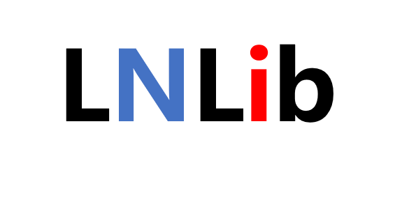
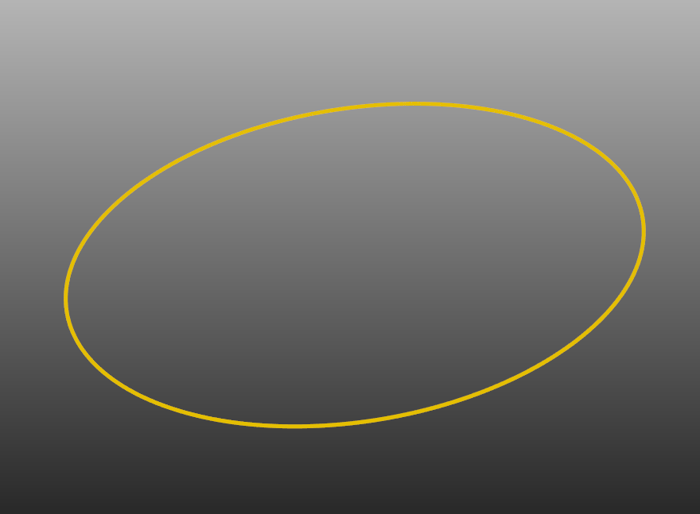
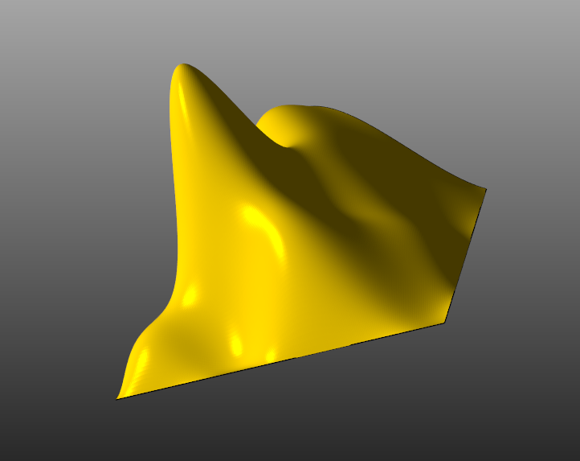

## Introduction
**LNLib is a C++ NURBS Algorithms Library.**  These algorithms are primary referenced from [The NURBS Book 2nd Edition](https://link.springer.com/book/10.1007/978-3-642-97385-7).  The APIs are re-designed to make it more friendly to users.

## Run LNLib
Please run build.bat first to construct C++ solution by CMake.

## Features
Basic Elements:
- UV
- XYZ
- XYZW
- Matrix4d
- LNObject

Algorithms in ***The Nurbs Book***:
|Chapter|Content|
|--|--|
|***Chapter 1***  | Basis Function Computation |
|***Chapter 1 to 4***  | Bezier/B-Spline/NURBS Curve and Surface |
|***Chapter 5***  | Curve and Surface Decomposition Knot Insertion/Refinement/Removal Degree Elevation and Reduction |
|***Chapter 6***  | Curve/Surface Point Inversion Surface Tangent Vector Inversion Curve/Surface Reparameterization Curve Transform and Reverse  Surface Swap and Reverse|
|***Chapter 7***  | Create Arc/Conic Curve |
|***Chapter 8***  | Create Bilinear/Cylindrical/Ruled/Revolved/CornerFillet Surface |
|***Chapter 9***  | Global/Local Curve/Surface Interpolation and Approximation |
|***Chapter 10***  | Create Swung/Loft/Sweep/Gordon/Coons Surface |
|***Chapter 11***  | Curve Modification in Control Point Locations or Weight Values |
|***Chapter 12***  | Curve Clamp/UnClamp/IsClamp   KnotVector IsUniform   Curve IsClosed/IsPeriodic|

Additional Algorithms:
|Description|Content|
|--|--|  
|***Basic Properties***  | Curve/Surface Curvature and Normal Curve Split/Segment/Merge/Offset Curve IsLinear/IsArc Curve Approximate Length Surface Approximate Area |
|***Curve Creation***  | Create Line/Cubic Hermite |
|***Tessellation***  | Curve Tessellation   Surface Triangulation|

## Visualization
[LNLibViewer](https://github.com/BIMCoderLiang/LNLibViewer) based on [VTK](https://vtk.org/)

## Contributing
Welcome join this project including discussions in **Issues** and make **Pull requests**.

## Author
LNLib is created by Yuqing Liang (BIMCoder Liang).

- bim.frankliang@foxmail.com
- 微信公众号：**BIMCoder**

## License
The source code is published under [GNU General Public License v3.0](https://www.gnu.org/licenses/), the license is available [here](LICENSE).

## Primary Reference
[The NURBS Book 2nd Edition](https://link.springer.com/book/10.1007/978-3-642-97385-7) by **Les Piegl & Wayne Tiller**
