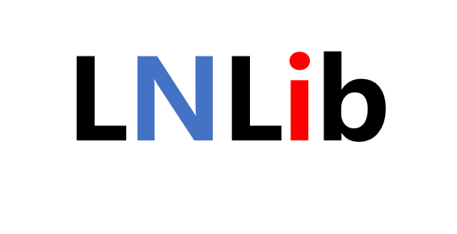
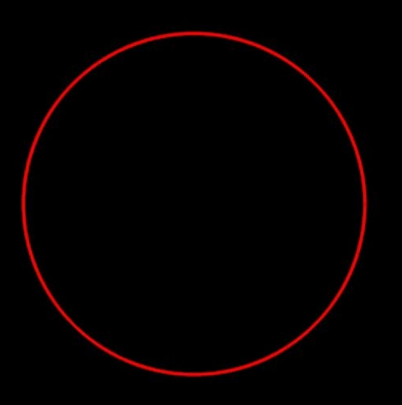
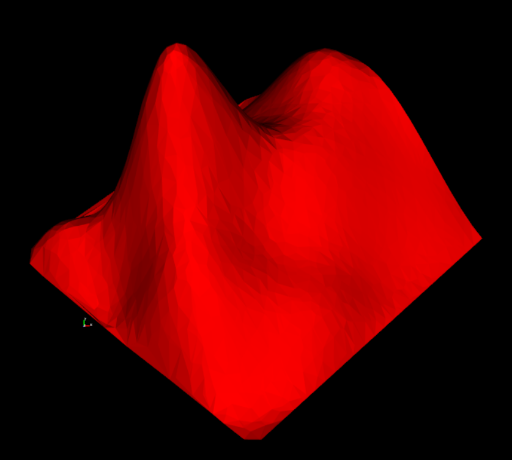
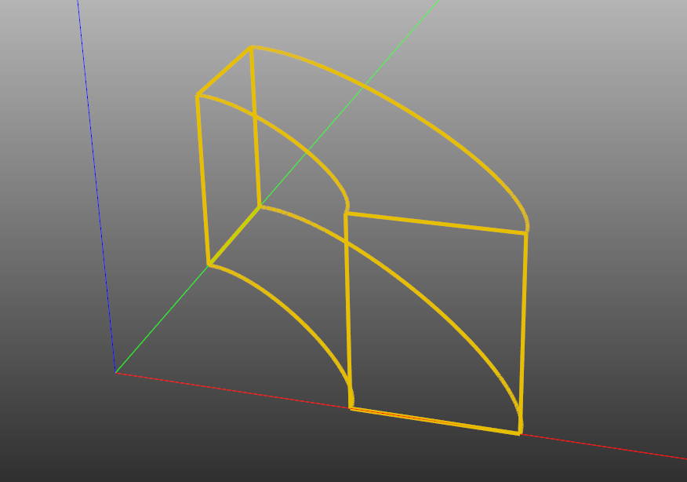
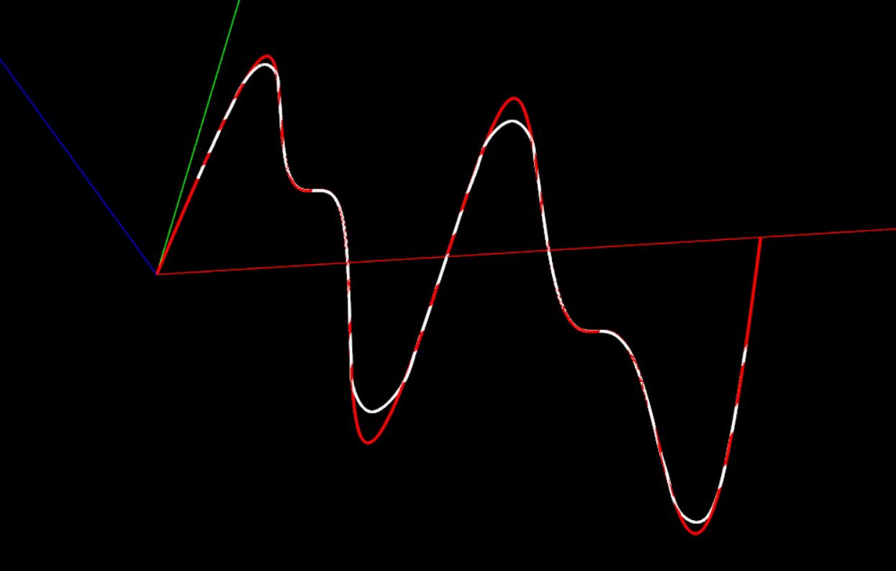
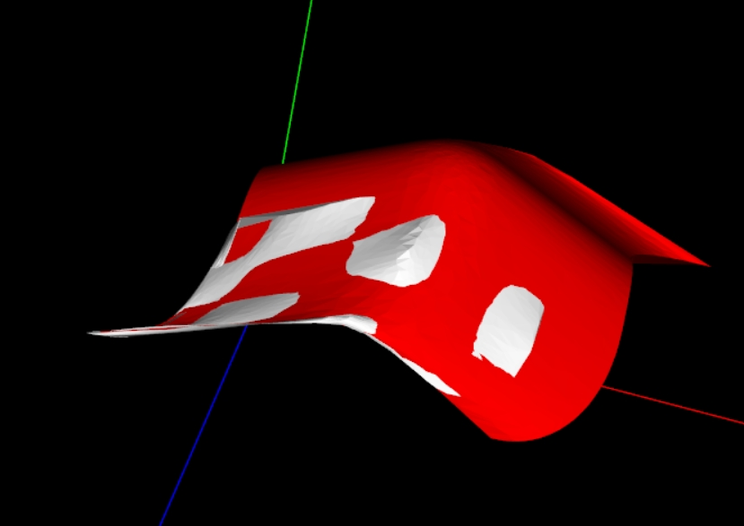

## Introduction
**LNLib is a NURBS Algorithms Kernel Library.** <br/>These algorithms are primary referenced from [The NURBS Book 2nd Edition](https://link.springer.com/book/10.1007/978-3-642-97385-7). <br/>
For NURBS **Curve | Surface | Volume**

 


## Build Project
|Project|API Language|Instruction|
|--|--|--|
|**LNLib**|C++|Run **build.bat** first to construct Native C++ solution by CMake|
|**LNLibjs**|WebAssembly|Run script in **emscripten** folder|
|**PyLNLib**|Python3.x|Switch `ENABLE_PYTHON_API` to `ON` in CMakeLists.txt and run **build.bat**|
|**LNLibSharp**|.NET8.0|Switch `ENABLE_DOTNET_API` to `ON` in CMakeLists.txt and run **build.bat**, LNLibSharp depends on **CApi.dll** generated by **CAPI project** for P/Invoke|

***notice***: Unit tests now only cover Native C++ APIs on Windows System.

## Features
Algorithms in ***The NURBS Book***:
|Chapter|Content|
|--|--|
|***Chapter 1***  | Basis Function Computation |
|***Chapter 1 to 4***  | Bezier/B-Spline/NURBS Curve and Surface |
|***Chapter 5***  | Curve and Surface Decomposition</br>Knot Insertion/Refinement/Removal</br>Degree Elevation and Reduction |
|***Chapter 6***  | Curve/Surface Point Inversion</br>Surface Tangent Vector Inversion</br>Curve/Surface Reparameterization</br>Curve Transform and Reverse</br> Surface Swap and Reverse|
|***Chapter 7***  | Create Arc/Conic Curve |
|***Chapter 8***  | Create Bilinear/Cylindrical/Ruled/Revolved/CornerFillet Surface |
|***Chapter 9***  | Global/Local Curve/Surface Interpolation and Approximation |
|***Chapter 10***  | Create Swung/Loft/Sweep/Gordon/Coons Surface |
|***Chapter 11***  | Curve Modification in Control Point Locations or Weight Values |
|***Chapter 12***  | Curve Clamp/UnClamp/IsClamp </br> KnotVector IsUniform </br> Curve IsClosed/IsPeriodic|

Additional Algorithms:
|Description|Content|
|--|--|  
|***NURBS Curve***  | Curve Curvature and Normal</br>Curve Split/Segment/Merge/Offset</br>Curve IsLinear/IsArc</br>Curve Approximate Length</br>Curve Extension (Tangent/Arc/Natural)</br>Curve Tessellation</br>Line/Cubic Hermite (as NURBS) Creation|
|***NURBS Surface***  | Surface AABB and OBB BoundingBox</br>Surface Curvature and Normal</br>Surface Approximate Area</br> Surface Triangulation |
|***NURBS Volume***  | Volume Degree Elevation</br>Volume Knot Insertion/Refinement</br>Volume Point Inversion</br>Volume Split</br>Extract Surface From Volume</br>Extract IsoCurve From Volume</br>Volume Swap and Reverse|

## Visualization


```C++
XYZ center(10, 0, 0);
XYZ xAxis(-1, 0, 0);
XYZ yAxis(0, 1, 0);
double startRad = 0;
double endRad = Constants::Pi;
double radius = 5;
LN_NurbsCurve arc;
NurbsCurve::CreateArc(center, xAxis, yAxis, startRad, endRad, radius, radius, arc);
```


```C++
int degreeU = 3;
int degreeV = 3;
std::vector<double> kvU = { 0,0,0,0,0.4,0.6,1,1,1,1 };
std::vector<double> kvV = { 0,0,0,0,0.4,0.6,1,1,1,1 };
std::vector<std::vector<XYZW>> controlPoints(6, std::vector<XYZW>(6));

controlPoints[0][0] = XYZW(0, 0, 0, 1);
controlPoints[0][1] = XYZW(6.666666, 0, 4, 1);
controlPoints[0][2] = XYZW(16.666666, 0, 22, 1);
controlPoints[0][3] = XYZW(33.333333, 0, 22, 1);
controlPoints[0][4] = XYZW(43.333333, 0, 4, 1);
controlPoints[0][5] = XYZW(50, 0, 0, 1);

controlPoints[1][0] = XYZW(0, 6.666667, 0, 1);
controlPoints[1][1] = XYZW(6.6666667, 6.666667, 9.950068, 1);
controlPoints[1][2] = XYZW(16.6666666, 6.666667, 9.65541838, 1);
controlPoints[1][3] = XYZW(33.3333333, 6.666667, 47.21371742, 1);
controlPoints[1][4] = XYZW(43.3333333, 6.666667, -11.56982167, 1);
controlPoints[1][5] = XYZW(50, 6.6666667, 0, 1);

controlPoints[2][0] = XYZW(0, 16.666666, 0, 1);
controlPoints[2][1] = XYZW(6.6666667, 16.666666, -7.9001371, 1);
controlPoints[2][2] = XYZW(16.6666666, 16.666666, 46.6891632, 1);
controlPoints[2][3] = XYZW(33.3333333, 16.666667, -28.4274348, 1);
controlPoints[2][4] = XYZW(43.3333333, 16.666667, 35.1396433, 1);
controlPoints[2][5] = XYZW(50, 16.6666667, 0, 1);

controlPoints[3][0] = XYZW(0, 33.3333333, 0, 1);
controlPoints[3][1] = XYZW(6.6666667, 33.3333333, 29.2877911, 1);
controlPoints[3][2] = XYZW(16.6666666, 33.3333333, -30.4644718, 1);
controlPoints[3][3] = XYZW(33.3333333, 33.3333333, 129.1582990, 1);
controlPoints[3][4] = XYZW(43.3333333, 33.3333333, -62.1717142, 1);
controlPoints[3][5] = XYZW(50, 33.333333, 0, 1);

controlPoints[4][0] = XYZW(0, 43.333333, 0, 1);
controlPoints[4][1] = XYZW(6.6666667, 43.333333, -10.384636, 1);
controlPoints[4][2] = XYZW(16.6666666, 43.333333, 59.21371742, 1);
controlPoints[4][3] = XYZW(33.3333333, 43.333333, -37.7272976, 1);
controlPoints[4][4] = XYZW(43.3333333, 43.333333, 45.1599451, 1);
controlPoints[4][5] = XYZW(50, 43.333333, 0, 1);

controlPoints[5][0] = XYZW(0, 50, 0, 1);
controlPoints[5][1] = XYZW(6.6666667, 50, 0, 1);
controlPoints[5][2] = XYZW(16.6666666, 50, 0, 1);
controlPoints[5][3] = XYZW(33.3333333, 50, 0, 1);
controlPoints[5][4] = XYZW(43.3333333, 50, 0, 1);
controlPoints[5][5] = XYZW(50, 50, 0, 1);

LNLib::LN_NurbsSurface surface;
surface.DegreeU = degreeU;
surface.DegreeV = degreeV;
surface.KnotVectorU = kvU;
surface.KnotVectorV = kvV;
surface.ControlPoints = controlPoints;
```


```C++
LN_NurbsVolume volume;

volume.DegreeU = 3;
volume.DegreeV = 1;
volume.DegreeW = 1;

volume.KnotVectorU = { 0.0, 0.0, 0.0, 0.0, 1.0, 1.0, 1.0, 1.0 };
volume.KnotVectorV = { 0.0, 0.0, 1.0, 1.0 };
volume.KnotVectorW = { 0.0, 0.0, 1.0, 1.0 };

volume.ControlPoints.resize(4);
for (int i = 0; i < 4; ++i) {
	volume.ControlPoints[i].resize(2);
	for (int j = 0; j < 2; ++j) {
		volume.ControlPoints[i][j].resize(2);
	}
}

double w_mid = std::sqrt(2.0) / 2.0;
w_mid = std::sqrt(3.0) / 2.0;

double tan_15 = 2.0 - std::sqrt(3.0);

double R_out = 10.0;

double out_x1 = R_out;                 double out_y1 = R_out * tan_15;
double out_x2 = R_out * tan_15;        double out_y2 = R_out;

double R_in = 6.0;
double in_x1 = R_in;                   double in_y1 = R_in * tan_15;
double in_x2 = R_in * tan_15;          double in_y2 = R_in;

volume.ControlPoints[0][0][0] = XYZW(R_out * 1.0, 0.0, 0.0, 1.0);
volume.ControlPoints[1][0][0] = XYZW(out_x1 * w_mid, out_y1 * w_mid, 0.0, w_mid);
volume.ControlPoints[2][0][0] = XYZW(out_x2 * w_mid, out_y2 * w_mid, 0.0, w_mid);
volume.ControlPoints[3][0][0] = XYZW(0.0, R_out * 1.0, 0.0, 1.0);

double Z_top = 5.0;
volume.ControlPoints[0][1][0] = XYZW(R_out * 1.0, 0.0, Z_top * 1.0, 1.0);
volume.ControlPoints[1][1][0] = XYZW(out_x1 * w_mid, out_y1 * w_mid, Z_top * w_mid, w_mid);
volume.ControlPoints[2][1][0] = XYZW(out_x2 * w_mid, out_y2 * w_mid, Z_top * w_mid, w_mid);
volume.ControlPoints[3][1][0] = XYZW(0.0, R_out * 1.0, Z_top * 1.0, 1.0);

volume.ControlPoints[0][0][1] = XYZW(R_in * 1.0, 0.0, 0.0, 1.0);
volume.ControlPoints[1][0][1] = XYZW(in_x1 * w_mid, in_y1 * w_mid, 0.0, w_mid);
volume.ControlPoints[2][0][1] = XYZW(in_x2 * w_mid, in_y2 * w_mid, 0.0, w_mid);
volume.ControlPoints[3][0][1] = XYZW(0.0, R_in * 1.0, 0.0, 1.0);

volume.ControlPoints[0][1][1] = XYZW(R_in * 1.0, 0.0, Z_top * 1.0, 1.0);
volume.ControlPoints[1][1][1] = XYZW(in_x1 * w_mid, in_y1 * w_mid, Z_top * w_mid, w_mid);
volume.ControlPoints[2][1][1] = XYZW(in_x2 * w_mid, in_y2 * w_mid, Z_top * w_mid, w_mid);
volume.ControlPoints[3][1][1] = XYZW(0.0, R_in * 1.0, Z_top * 1.0, 1.0);
```
**Visualization Tool** [LNLibViewer](https://github.com/BIMCoderLiang/LNLibViewer) based on [VTK](https://vtk.org/)
More Samples can be found in [tests](tests) folder

## NURBS Fitting by Neural Network

Red one is the target and white one is fitting result.
More details could be found in [ND-LNLib](https://github.com/BIMCoderLiang/NURBS-Diff-with-LNLib) based on [LibTorch](https://pytorch.org/cppdocs/installing.html) (PyTorch C++ version)




## Convert to OpenCascade NURBS surface
```C++
#include "LNObject.h"
#include "XYZ.h"
#include "XYZW.h"
#include "NurbsSurface.h"
#include "KnotVectorUtils.h"
#include <Geom_BSplineSurface.hxx>

void ConvertToOpenCascadeSurface(const LNLib::LN_NurbsSurface& surface, Handle(Geom_BSplineSurface)& internalSurface)
{
    LNLib::NurbsSurface::Check(surface);

    std::vector<double> knotU = surface.KnotVectorU;
    std::vector<double> knotV = surface.KnotVectorV;

    const int numPolesU = static_cast<int>(surface.ControlPoints.size());
    const int numPolesV = static_cast<int>(surface.ControlPoints[0].size());

    TColgp_Array2OfPnt poles(1, numPolesU, 1, numPolesV);
    TColStd_Array2OfReal weights(1, numPolesU, 1, numPolesV);

    for (int i = 0; i < numPolesU; i++) {
        for (int j = 0; j < numPolesV; j++) {
            const LNLib::XYZW& wcp = surface.ControlPoints[i][j];
            const LNLib::XYZ& cp = wcp.ToXYZ(true);
            poles.SetValue(i+1, j+1, gp_Pnt(cp.GetX(), cp.GetY(), cp.GetZ()));
            weights.SetValue(i+1, j+1, wcp.GetW());
        }
    }

    std::map<double, int> mapU = LNLib::KnotVectorUtils::GetKnotMultiplicityMap(knotU);
    TColStd_Array1OfReal knotsU(1, static_cast<int>(mapU.size()));
    TColStd_Array1OfInteger multsU(1, static_cast<int>(mapU.size()));
    
    std::vector<double> Ukeys;
    Ukeys.reserve(mapU.size());
    std::vector<int> UMults;
    UMults.reserve(mapU.size());
    for (auto it = mapU.begin(); it != mapU.end(); ++it) {
        Ukeys.emplace_back(it->first);
        UMults.emplace_back(it->second);
    }
    for (int i = 0; i < Ukeys.size(); i++) {
        knotsU.SetValue(i+1, Ukeys[i]);
    }
    for (int i = 0; i < UMults.size(); i++) {
        multsU.SetValue(i+1, UMults[i]);
    }

    std::map<double, int> mapV = LNLib::KnotVectorUtils::GetKnotMultiplicityMap(knotV);
    TColStd_Array1OfReal knotsV(1, static_cast<int>(mapV.size()));
    TColStd_Array1OfInteger multsV(1, static_cast<int>(mapV.size()));

    std::vector<double> Vkeys;
    Vkeys.reserve(mapV.size());
    std::vector<int> VMults;
    VMults.reserve(mapV.size());
    for (auto it = mapV.begin(); it != mapV.end(); ++it) {
        Vkeys.emplace_back(it->first);
        VMults.emplace_back(it->second);
    }
    for (int i = 0; i < Vkeys.size(); i++) {
        knotsV.SetValue(i+1, Vkeys[i]);
    }
    for (int i = 0; i < VMults.size(); i++) {
        multsV.SetValue(i+1, VMults[i]);
    }

    internalSurface = new Geom_BSplineSurface(
        poles, weights, knotsU, knotsV,
        multsU, multsV,
        surface.DegreeU, surface.DegreeV);
}
```
More Details could be found in [LNLibExtension](https://github.com/BIMCoderLiang/LNLibEx) Library, which used for **export nurbs surfaces to STEP or IGES** format file.

## Document
Welcome to use https://deepwiki.com/BIMCoderLiang/LNLib powered by Devin.

## Contributing
Welcome join this project including discussions in **Issues** and make **Pull requests**.
- Contributors:
<a href="https://contributors-img.web.app/image?repo=BIMCoderLiang/LNLib">
  
</a><br/>

- Algorithm Adviser: 
[csulijunji](https://github.com/csulijunji)

## Use Cases
- [fplnlib](https://github.com/zamtmn/fplnlib): **Pascal** Version NURBS Algorithm
- [VL.Nurbsy](https://github.com/antokhio/VL.Nurbsy): **Native C#** Version of NURBS Algorithm

## Contact
LNLib is created by Yuqing Liang (BIMCoder Liang).

- email: bim.frankliang@foxmail.com
- Weixin Official Account (微信公众号)：**BIMCoder**

## License
The source code is published under [LGPL 2.1](https://www.gnu.org/licenses/), the license is available [here](LICENSE).

## Primary Reference
[The NURBS Book 2nd Edition](https://link.springer.com/book/10.1007/978-3-642-97385-7) by **Les Piegl & Wayne Tiller**
